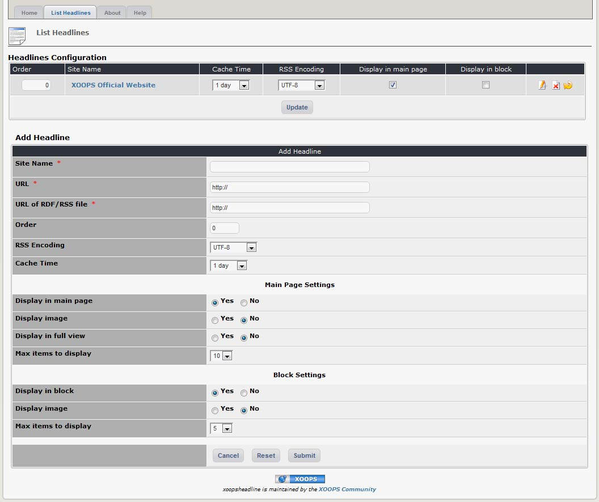
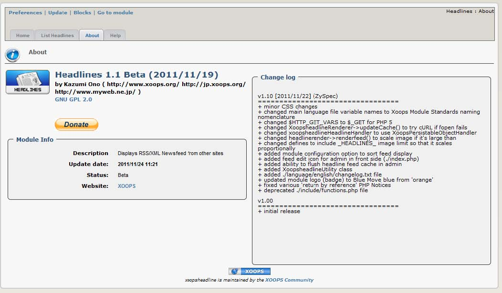

# 2.0 Administration Menu

There are four options on top:

 |Option | Action| 
 | -- | --    | 
 |Preferences | Here you can configure your preferences for the module|

| Option | Action |
|--|--|
| Preferences | Here you can configure your preferences for the module |

|Update|Click here if you’ve made some changes to the module, uploaded new files, etc. – this will recompile the module and update all entries in the database|
|Blocks|When you click here, it will redirect you to the Blocks section of XOOPS, and select the blocks related to your module|
|Go to module|If the module is visible on the user side, this will take you there|

There are three Tabs in the Administration of the XOOPS Partners module: 
-	Home
-	About 
-	List Headline
-	Help

   
*Figure 4 The “List Headlines” Tab*

There are no configuration options available for the module per se; rather you add, configure and delete individual news feeds through the ‘List headlines’ link in the administrative menu. This opens the form shown below. When adding a new feed the options are:

|Option|	Function|
|--|--|
|**Add Headlines**	||
|Site name:|	The title of the website providing the feed|
|URL:|	The URL of the website providing the fee|
|URL of RDF/RSS file:|	Important ! The URL to access the actual feed itself. If you get this wrong, the feed will not work.|
|Order:	|Sets the order in which this feed will appear in the list relative to the others. This is the same as ‘weighting’ used in most other modules.|
|RSS Encoding:|	Feeds can be encoded in different ways. You need to set the right encoding so that the module can read the feed. To find out what encoding a feed is using, open the feed URL and look at the contents of the file in your browser. Usually the type of encoding is indicated in the first few lines.|
|Cache time:|	The contents of feeds are cached for a specified period of time – the Headlines module doesn’t call the feed from the remote site every time it is accessed ! You can choose to cache feeds anywhere from 1 hour to 1 month. Consider how frequently the remote site is updated and set your cache time appropriately. Bear in mind that you are drawing on the bandwidth of the remote site each time the feed is called. |
|**Main Page Settings**	||
|Display in main page:|	Do you want this feed to be visible on the Headlines index page ? Default is ‘yes’.|
|Display image:|Some feeds include a logo or image for the remote site. Do you want to display it, if it is available ? Default is ‘no’.|
|Display in full view:|	Select ‘yes’ to display the headlines plus the first few lines of each story. If you select ‘no’ (default) only the headlines will be displayed.|
|Max items to display:|	How many of the most recent headlines/items do you want to display from this feed ? You can choose from 1 to 30. The default is 10.|
|**Block Settings**	||
|Display in block ?	|Do you want this feed to be included in the Headlines block ? Default is ‘yes’.|
|Display image ?|	Do you want to display the feed’s image in the block ? Default is ‘no’.|
|Max items to display|	How many of the most recent headlines/items do you want to display from this feed ? You can choose from 1 to 30. The default is 5.|

Once a feed has been entered it will be included in the summary feed list, where you can easily edit its display modes, order, cache time, and encoding. Select the ‘Edit’ link to configure other properties.
 
    
*Figure 5 The “About the Module” Tab*

   
*Figure 6 The “Help” Tab*

 
